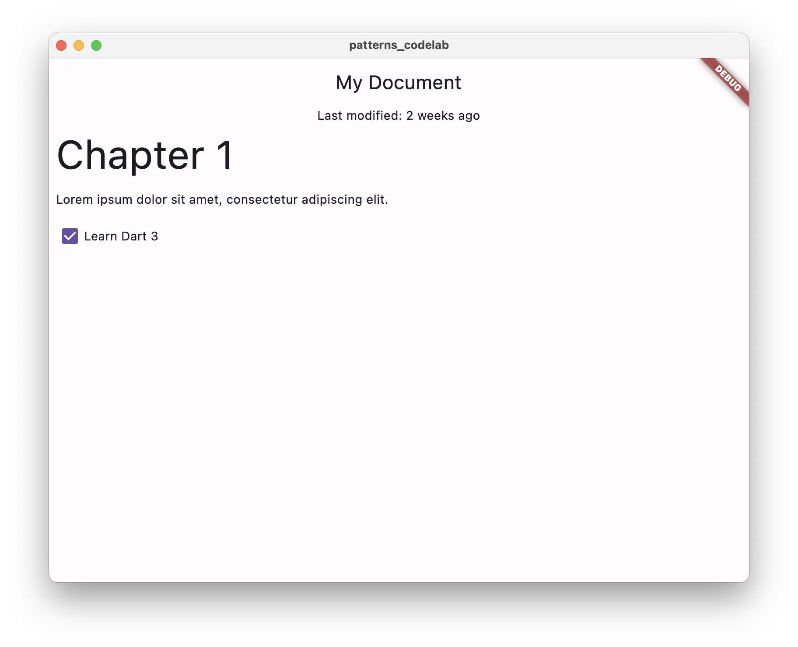

# Introduction

Dart 3 introduces patterns to the language, a major new category of grammar. Beyond this new way to write Dart code, there are several other language enhancements, including

- records for bundling data of different types,
- class modifiers for controlling access, and
- new switch expressions and if-case statements.
- These features expand the choices you have when writing Dart code. In this codelab, you learn how to use them to make your code more compact, streamlined, and flexible.

## What you'll build

This codelab creates an application that displays a JSON document in Flutter. The application simulates JSON coming from an external source. The JSON contains document data such as the modification date, title, headers, and paragraphs. You write code to neatly pack data into records so that it can be transferred and unpacked wherever your Flutter widgets need it.

You then use patterns to build the appropriate widget when the value matches that pattern. You also see how to use patterns to destructure data into local variables.

